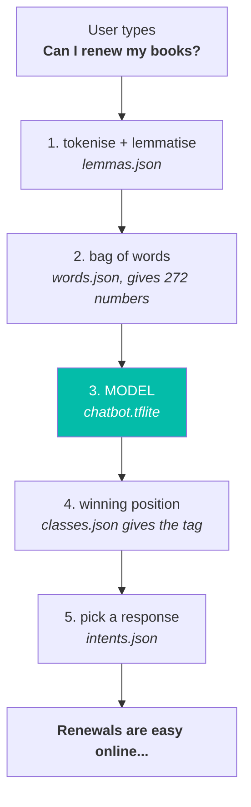

# Chatbot

An offline library-assistant chatbot for Android. Kotlin, Jetpack Compose,
TensorFlow Lite. No network calls — the model runs on the device.

The model is trained separately in Python:
**[NimmiSarahMathew/chatbot-python](https://github.com/NimmiSarahMathew/chatbot-python)**

## How a message is answered



Only step 3 is machine learning. It turns a sentence into a single number.
Everything else is plain Kotlin.

## Limits

The bot can only say sentences written in `intents.json`. It classifies, it does
not generate. Adding a new intent means editing the Python training data and
retraining — the model was built with exactly 25 outputs.

Rotating the device clears the transcript. Persistence has not been covered.

Inference runs on the main thread (a larger model would need moving to a coroutine)

## Assets

All five live in `app/src/main/assets`. They are derived from the Python
project's training output — the model plus its vocabulary and tag lists.

> The Python repo stores the vocabulary and tags as `words.pkl` / `classes.pkl`.
> Kotlin cannot read pickle and has no WordNet, so the JSON copies here are
> exported from them. Re-export after any retrain — the vocabulary order defines
> the model's input wiring, so an old word list with a new model fails silently.

| File | Job |
|---|---|
| `chatbot.tflite` | The classifier. Takes 272 floats, returns 25 probabilities. |
| `words.json` | Vocabulary. Position 111 means `heya`, and so on. |
| `lemmas.json` | **Needed only because Kotlin has no WordNet.** Python lemmatises using NLTK's WordNet library; Android has no equivalent, so the word→lemma pairs the model actually needs (`books`→`book`) are exported as a plain lookup table. |
| `classes.json` | Turns the winning position back into an intent tag. |
| `intents.json` | The responses. One is chosen at random per tag. |

**Replace all five together.** `words.json` and `classes.json` define the model's
input and output wiring. A new model with an old word list still runs, still
looks confident, and is wrong on every message.

## Code

```
app/src/main/java/com/example/chatbot/
├── MainActivity.kt          entry point
├── Constants.kt             asset names, confidence floor, contractions
├── ml/
│   ├── TextEncoder.kt       tokenise + lemmatise + bag of words
│   └── ChatEngine.kt        loads assets, runs the model, picks a response
└── ui/
    ├── ChatScreen.kt        the screen
    ├── Message.kt
    ├── components/          MessageBubble, MessageInput
    └── theme/               colours, theme

app/src/test/java/com/example/chatbot/
└── ml/TextEncoderTest.kt    parity tests
```

`ml/` has no Compose imports and `ui/` has no TensorFlow imports.

### TextEncoder

The encoding must match the Python training pipeline **exactly**. If the two
diverge, word positions shift and predictions break with no error raised.

`TextEncoder` is deliberately free of Android and TensorFlow dependencies, so it
can be unit-tested on the JVM against slot positions generated by the Python
side. Two cases are easy to get wrong:

- **Contractions** — NLTK splits `don't` into `do` + `n't`, so the Kotlin
  tokeniser does the same.
- **Lemmas** — `books` must become `book` to match the vocabulary, using the
  exported lookup rather than a library.

### ChatEngine

Loads the five assets, delegates encoding to `TextEncoder`, runs the model and
maps the winning position to a response. It falls back rather than trusting the
model when nothing is recognised, because an all-zero row still produces a
confident-looking answer.

## Build

```bash
./gradlew :app:assembleDebug
```

```bash
./gradlew :app:testDebugUnitTest
```

| Requires | |
|---|---|
| JDK | 17 |
| Gradle | 8.11.1 |
| AGP | 8.10.0 |
| compileSdk | 35 |
| minSdk | 24 |

